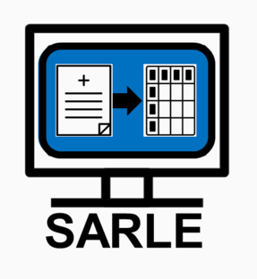

# sarle-labeler

## Description

This is the Python implementation of Sentence Analysis for Radiology Label Extraction (SARLE),
a method to automatically extract structured labels from radiology
reports.

The SARLE method is described in detail in our [Medical Image Analysis paper](https://doi.org/10.1016/j.media.2020.101857).
The paper is also available [on arXiv](https://arxiv.org/ftp/arxiv/papers/2002/2002.04752.pdf).

If you find this work useful in your research, please consider citing us:

Draelos R.L., et al. "Machine-Learning-Based Multiple Abnormality Prediction with Large-Scale Chest Computed Tomography Volumes." *Medical Image Analysis* (2020).

## Requirements

The requirements to run SARLE are listed in requirements.txt.

[This Singularity container](https://github.com/rachellea/research-container)
also includes the dependencies.

For SARLE-Rules, the only requirements are numpy and pandas for data organization,
matplotlib for visualizations, and scikit-learn for evaluation metrics.
For SARLE-Hybrid, fasttext is additionally required. Note that fasttext is currently available for Linux but not Windows.

SARLE-Rules outperforms SARLE-Hybrid on our chest CT reports data set, and therefore
SARLE-Rules was the final method we used for radiology report label extraction.
The labels produced by SARLE-Rules were used to train a CNN on whole CT volumes.

If you wish to run only SARLE-Rules and avoid the fasttext dependency then you
can comment out the line `from sentence_classifier import ClassifySentences` at
the top of main.py and comment out the line `run_SARLE_Hybrid_demo()` at
the bottom of main.py, and then only the SARLE-Rules demo will run.

## Usage

To run SARLE-Rules and SARLE-Hybrid on the public OpenI chest x-ray reports
data, run this command:

`python main.py`

The required format of the data is demonstrated in the directory data_cxr, which contains
the public OpenI chest x-ray data set already organized into the required format.

There are three variants of SARLE-Rules: "duke_ct", "cxr_amb_pos", and
"cxr_amb_neg".

* "duke_ct" is the SARLE-Rules version developed for chest CT reports and
described in the paper. It was developed
on a data set of Duke chest CT reports. Due to patient privacy concerns there
are currently no plans to release the Duke chest CT reports data set. By default in "duke_ct"
ambiguous findings are marked positive (e.g. "possible atelectasis" results
in a positive label for atelectasis.)
* "cxr_amb_pos" is the SARLE-Rules version developed for chest x-ray reports, in which
ambiguous findings are marked positive.
* "cxr_amb_neg" is the SARLE-Rules version developed for chest x-ray reports, in which
ambiguous findings are marked negative.

By default in main.py, all three SARLE-Rules variants as well as SARLE-Hybrid
will be run on the OpenI chest x-ray data. Results from each of the four variants
will be automatically saved in separate directories.

## Tests

To run the unit tests, run this command:

`python unit_tests.py`

## Customization

If you would like to use SARLE to make predictions on a custom set of
abnormalities, you can specify those custom abnormalities in the vocabulary
files. The vocabulary files are vocab/vocabulary_ct.py and vocab/vocabulary_cxr.py.

### Logo

The SARLE logo includes Creative Commons icons from the Noun Project: [computer](https://thenounproject.com/term/medical/879529/),
[report](https://thenounproject.com/term/medical/959388/),
and [table](https://thenounproject.com/search/?q=table&i=250445).